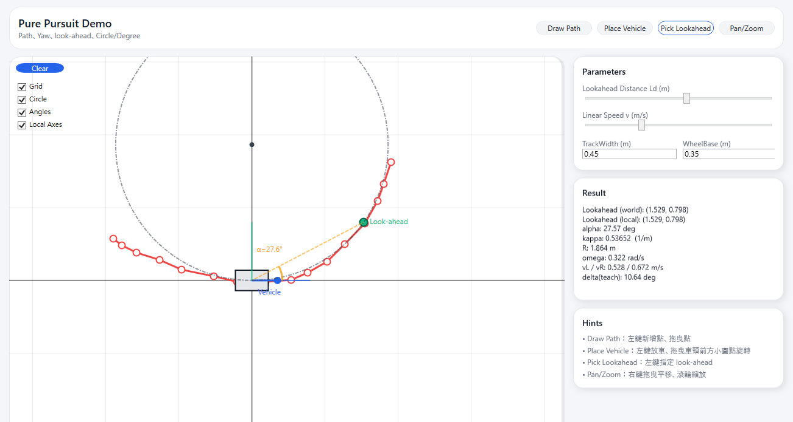

# PurePursuitDemo

## Build
- .NET 8 SDK

## Math
1) Transform the look-ahead point into the vehicle frame `(x_local, y_local)`  
2) Compute the heading angle to that point  
   - `alpha = atan2(y_local, x_local)`
3) Convert that angle into curvature (how sharp to turn)  
   - `kappa = 2 * sin(alpha) / Ld`
4) Turn curvature into angular speed  
   - `omega = v * kappa`
5) Differential-drive wheel speeds (track width = W)  
   - `vL = v - omega * (W/2)`
   - `vR = v + omega * (W/2)`

## Usage
- Draw Path：Left-click to add path points; drag red point to adjust them.
- Place Vehicle：Left-click to place the vehicle; drag the small blue circle in front of the vehicle to adjust yaw.
- Pick Lookahead：Left-click to specify the green look-ahead point.
- Pan/Zoom：Right-click and drag to pan; use the mouse wheel to zoom.

On the right panel, you can adjust Ld, v, TrackWidth, and WheelBase; the results and the drawing canvas update in real time.
